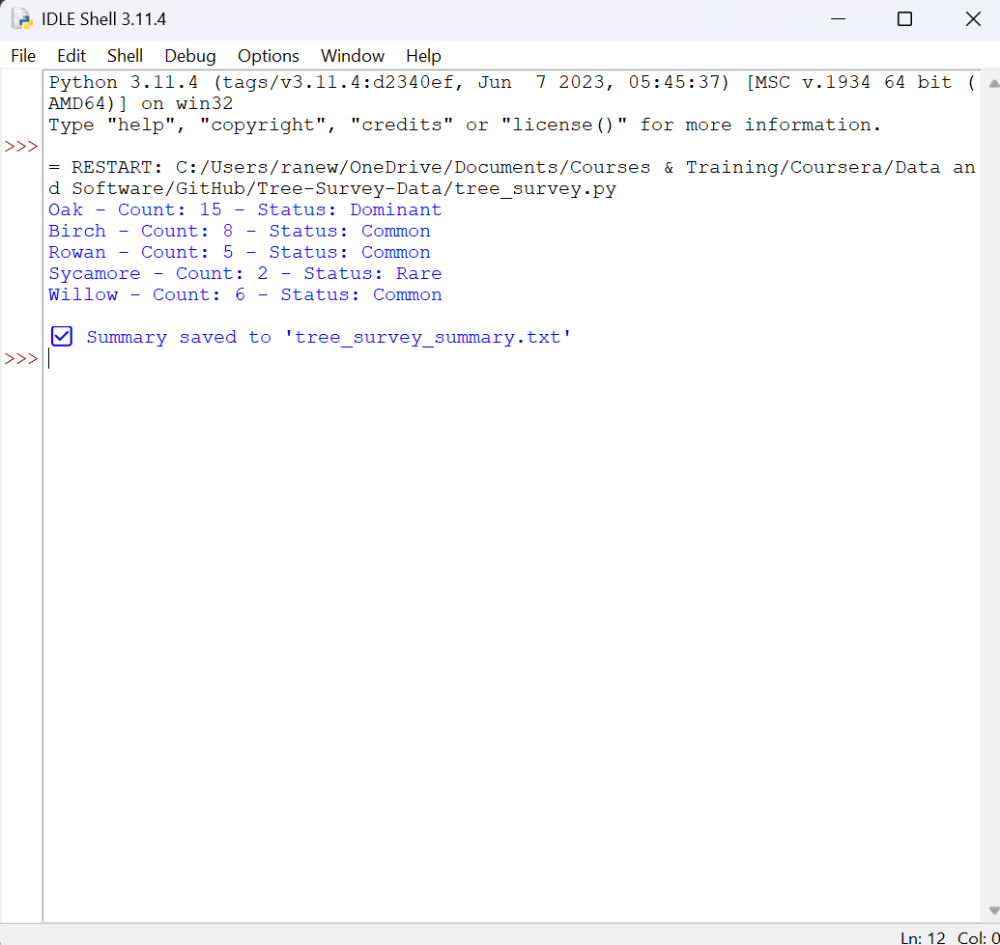

# Tree-Survey-Data
Survey on Most Common Species of UK Trees Found Categorised by Rarity of Findings in Surrey
It analyses the number of UK trees observed, classifies species based on rarity levels, identifies the most and least common trees, and saves the results to a summary text file.

---

##  Project Purpose

The goal of this project is to demonstrate practical Python skills in an ecological context.  
It is designed for early-career conservationists, ecologists, or data enthusiasts who want to automate simple survey summaries and enhance their coding portfolios.

---

##  Features

- Calculate total trees observed
- Categorise species by rarity levels:
  - Dominant (≥10)
  - Common (≥5)
  - Rare (≤1)
- Identify the most and least observed species
- Save output to a clean `tree_survey_summary.txt` file
- Provide real-world conservation-themed coding experience

---

##  Skills Used

- **Python 3**: Functions, loops, conditionals, dictionaries, list operations
- **File Handling**: Writing output to a `.txt` file
- **Data Categorisation**: Defining rarity classes based on count
- **Basic Git and GitHub**: Version control and publishing a portfolio project

---

##  How to Run the Script

1. Clone or download this repository
2. Ensure Python 3.x is installed on your machine
3. Open a terminal/command prompt in the project folder
4. Run the script:
```bash
python tree_survey.py
```
## 📷 Example Output


